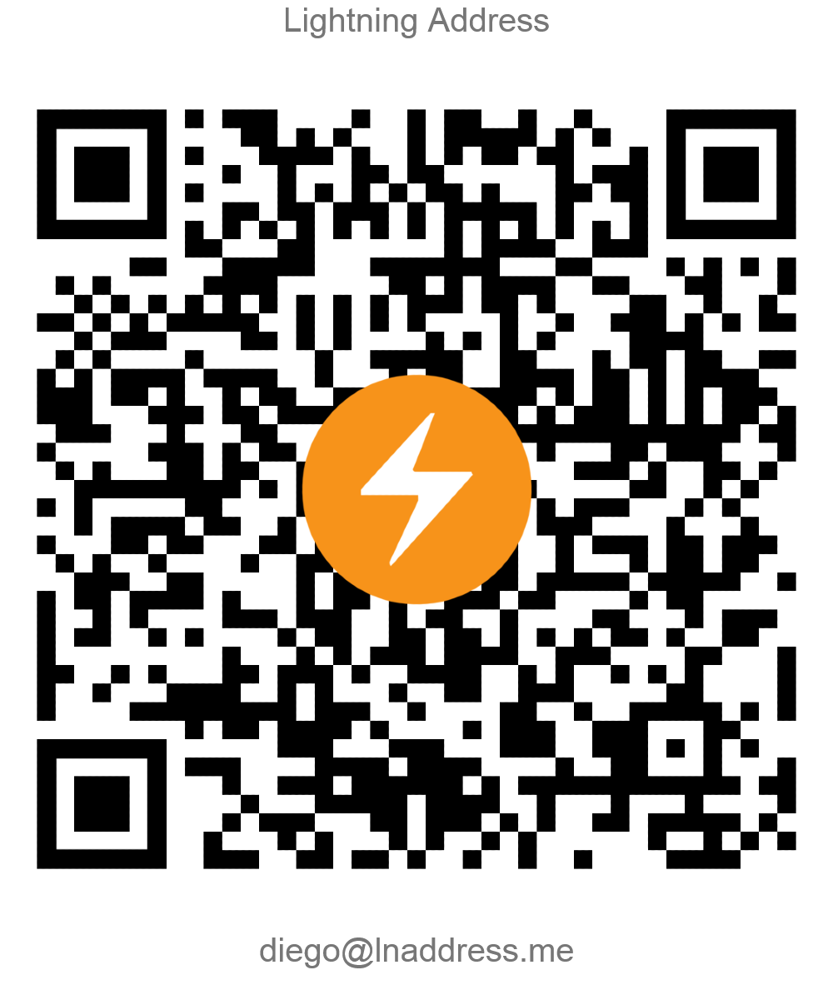

## Installation and Extraction

- From the repo [main](https://github.com/dieqohc/HSM-to-XPRV-recovery-tool) page look for the "Code" button, click on it and next look for the "Download ZIP" option, click on it and depending on your browser options it should either save it directly to the "Downloads" directory in your computer, or ask you to choose a location to save the file.

- Once it finishes the download (it should be pretty quick), depending on your system and desktop environment you will have to extract the contents of the .ZIP into a folder 

- Now if you are on a Linux distro or MacOS (afaik), you can use the _cd_ commands in order to get to your desired directory, for example if the file is in the Downloads directory, you can use:
	`cd /Downloads/HSM-to-XPRV-recovery-tool-main` (you can use the tab to autocomplete the names.)
    - On Windows you can navigate normally to the folder extracted in your file explorer and in an empty space press Shift + Right Click, and you should the option "Open a PowerShell window here"

### 1. Checking the existence of Python

- If you completed the steps above and now you have an open terminal powershell we will check the existence of Python in our system using the following command:
   `python --version`
   If it is installed you should see an output like: *Python 3.x.x*
- If it is not installed or the version it shows is lower than 3.4.x, head to https://www.python.org/ and install the latest version of Python for your system, and when it is finished run the command above again. (⚠ If you are on windows make sure to check the option to add Python to PATH on the installer.)
- After you get a successful output for the command and while you are with the terminal open in the location of the extracted folder run the following command in order to create a virtual environment (this is not mandatory, but it is a good practice to avoid breaking dependencies of other programs in the system):
```
python -m venv venv
```
(*clarification, the last venv is the name of the directory mentioned below, you can change it but it is advisable to leave it as it is for consistency and to copy and paste the commands if you so wish*)
### 2. Activating the Python venv

7. To activate your venv on Windows, you need to run a script that gets installed by venv. If you created your venv in a directory called `venv`, the command would be:
#### Windows venv activation

**In cmd.exe**
`venv\Scripts\activate.bat`

**In PowerShell**
`venv\Scripts\Activate.ps1`
#### Linux and MacOS venv activation

On Linux and MacOS, we activate our virtual environment with the source command. If you created your venv in the `myvenv` directory, the command would be:

`source venv/bin/activate`

You will now it is activated as the first characters of the next line after running command will begin with (venv)

### 3. Installing the required libraries

In order to perform this installation you will have to run the following command

```bash

pip install -r requirements.txt

```

In case you get an error stating that pip doesn't exist you will have to find for the way to actually install it, for your system, although most of the time it is usually solved just by running:
- `py -3 -m ensurepip` OR
- `python get-pip.py`

## Usage

From here the usage is easy, you just should move your file either manually or using the terminal to the extracted directory in order for the script to work by default, from here you just have to have a couple of things in mind.

- Within the '*recovery.py*' file you can change and specify the route to the *'hsm_secret'* file, by default it be in the same directory than recovery.py and there is an exception in the .gitignore file in order to avoid leaks. (always check twice if you plan to upload this data anywhere.)
- It is highly recommended to move your funds out to a safe wallet ASAP once you get this information displayed on the terminal as there is no warranty of no trace or history after the XPRV has been revealed, so once you get it import the wallet to a compatible software (sparrow wallet works well) and make a transaction preferably with replace by fee (RBF) turned off.

Now, to run the script in the same terminal location, run the recovery.py file, and in an instant you will have your xprv and xpub printed to screen along with a small warning like this.

The command to run the script with python is:
`python recovery.py`

```
XPRV: xprv9abcjdldlkjdflksdfvlksdfv122...
XPUB: xpub6sdvclsdkvfsdv87875tpoijsc09...

When importing the XPRV the derivation path for the funds is "m/*" which can be represented as "m/0".
```

## Importing the XPRV to Sparrow

- To get sparrow wallet go to the official website which is: https://sparrowwallet.com/download/ 
	- Please check twice the URL, and look how to verify the integrity of the software with PGP if possible to check you are running the original one.
- Once installed you should open the wallet, connect it to a server and do the following steps:
	- *File>New Wallet>(Give name to wallet)>New or Imported Software Wallet>Master Private Key (BIP32)*
- If you made the right choices, you should be able to paste the XPRV into Sparrow, once you do it and click on import it will ask you to determine the derivation path, which by default is "m/84'/0'/0'", you should delete most of this, and replace it with "m/0" without the quotations, and click on the button at the right that states "Import custom derivation path".
	- It should show a summary of the info, for which you just have to click on "Apply" at the bottom and all your transactions should start loading in the transactions and or UTXOs tab, it shouldn''t take to long but this depends on your connection and the electrum/bitcoin core server you are connected too.
    - ⚠ In case there are UTXOs (coins received) that don't show on the wallet, please try adding again the wallet in the same process but this time change the dialog from "Native SegWit" to "Taproot" before clicking on "New or Imported Software Wallet" which you cna find after clicking *File>New Wallet>(Give name to wallet)*
- Now assuming everything worked as intended, congrats! now you have access to your on-chain funds for which you can now move out to a safe wallet of yours.

## Donations

If you have found this tool valuable please consider making a lightning donation to **[diego@lnaddress.me](https://lnaddress.me/.well-known/lnurlp/diego)** or scanning the QR below.

