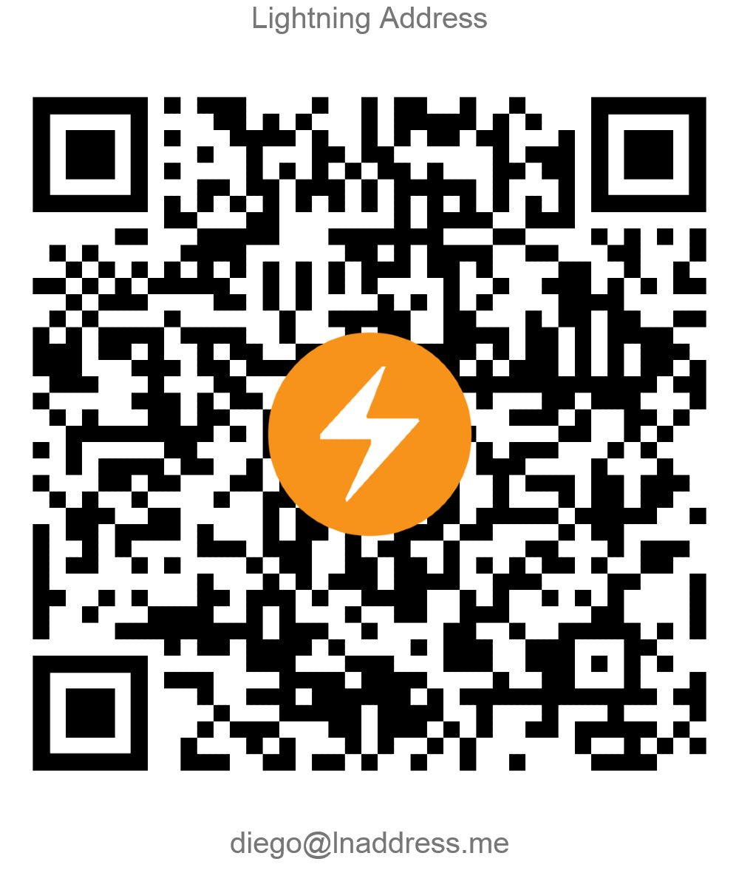

# HSM_Secret to XPRV tool

This is a tool created in order to help those in the hard situation of having funds locked (on-chain) after the failure of [core-lightning](https://github.com/ElementsProject/lightning), specially addressed but not limited to those having problems with c-lightning on the [Umbrel]() software.

## Installation

> If you require a more detailed guide with step by step instructions click [here](./Extended%20Guide.md)

1. Download the repository as a .zip and place it where you want, extract the contents and open the folder with the extracted contents. 
2. Run the following command to install the dependencies:s

⚠**WARNING**: In order to avoid the dependencies breaking any of your system packages, it is advised to work within a Virtual environment instance of your preference.' 

```bash
pip install -r requirements.txt
```

## Usage

1. Within the recovery.py file you can change and specify the route to the *'hsm_secret'* file, by default it is in the same directory and there is an exception in the .gitignore file in order to avoid leaks. (always check twice.)

2. Simply open a terminal or run the recovery.py file, and in an instant you will have your xprv and xpub printed to screen along with a small warning like this.

```
XPRV: xprv9abcjdldlkjdflksdfvlksdfv122...
XPUB: xpub6sdvclsdkvfsdv87875tpoijsc09...

When importing the XPRV the derivation path for the funds is "m/*" which can be represented as "m/0".
```

The xprv can be imported on Sparrow wallet in order to have control and availability of your funds. 
- This can be achieved by going to *File>New Wallet>(Give name to wallet)>New or Imported Software Wallet>Master Private Key (BIP32)*

It is recommended to move your funds out to a safe wallet ASAP once you get this information displayed as there is no warranty of no trace or history after the data has been displayed on the terminal, and a third party could get access to this.

## Contributing

Pull requests are welcome. For major changes, please open an issue first to discuss what you would like to change or to get any help.

## License

The license for this project is GNU GPLv3

To learn more about the permissions, conditions and limitations of this license go here: [GNU General Public License v3.0](https://choosealicense.com/licenses/gpl-3.0/)

## Thank yous

1. Thanks to the core-lightning community and developers.
2. Thanks to [Baan Twentyfifth](https://community.corelightning.org/u/64d0a6f3) for the idea and his [BIP32 implemention](https://github.com/baam25simo/bip32_4dev).

## Donations

If you have found this tool valuable please consider making a lightning donation to **[diego@lnaddress.me](https://lnaddress.me/.well-known/lnurlp/diego)** or scanning the QR below.


